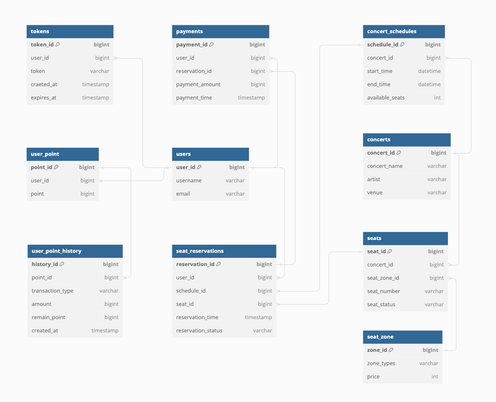
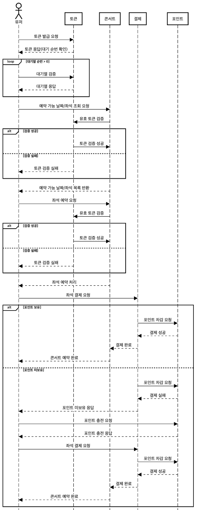
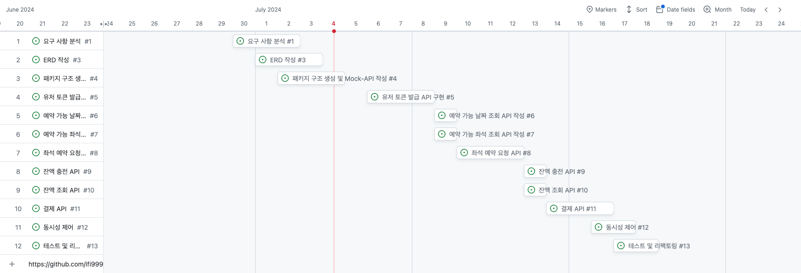

# 콘서트 예약 서비스

## 소개
- 대기열 시스템과 좌석 예약 서비스를 구현
- 좌석 예약 시에 미리 충전한 잔액을 이용
- 좌석 요청 시, 결제가 이루어지지 않더라도 일정 시간동안 다른 유저가 해당 좌석에 접근할 수 없음

## 요구 사항
- 유저 토큰 발급 API
- 예약 가능 날짜 조회 API
- 예약 가능 좌석 조회 API
- 좌석 예약 요청 API
- 잔액 충전 API
- 잔액 조회 API
- 결제 API
> 각 기능 및 제약 사항에 대해 단위 테스트를 반드시 하나 이상 작성
> 
> 다수의 인스턴스로 어플리케이션이 동작하더라도 기능에 문제가 없도록 작성
> 
> 동시성 이슈 및 대기열 개념 고려

## API 스펙
<details>
    <summary>1. 유저 대기열 토큰 기능</summary>

   - 서비스를 이용할 토큰을 발급받는 API를 작성합니다.

   - 토큰은 유저의 UUID와 해당 유저의 대기열을 관리할 수 있는 정보(대기 순서 or 잔여 시간 등)를 포함

   - 이후 모든 API는 위 토큰을 이용해 대기열 검증을 통과해야 이용 가능

   > 기본적으로 폴링으로 본인 대기열 확인한다고 가정. 다른 방안 또한 고려해보고 구현해 볼 수 있음

   ### 유저 토큰 발급 `POST`
   
   #### 요청 바디
   ```json
   {
     "userId": 1
   }
   ```
   
   #### 요청 예시
   ```text
   POST /api/token
   Content-Type: application/json
   
   {
     "userId": 1
   }
   ```
   
   #### 응답 바디
   ```json
   {
     "userId": 1,
     "token": "token"
   }
   ```

</details>

<details>
    <summary>2. 예약 가능 날짜 / 좌석 API</summary>

   - 예약가능한 날짜와 해당 날짜의 좌석을 조회하는 API를 각각 작성

   - 예약 가능한 날짜 목록을 조회

   - 날짜 정보를 입력받아 예약가능한 좌석정보를 조회

   > 좌석 정보는 1 ~ 50까지의 좌석 번호로 관리

   ### 예약 가능 날짜 조회 `GET`
   
   #### 요청
   Path Parameter:
   - concertId (long): 조회할 콘서트의 ID
   
   #### 요청 예시
   ```text
   GET /api/123/available-dates
   ```
   
   #### 응답 바디
   ```json
   [
     {
       "concertDate": "2024-07-11T12:00:00"
     },
     {
       "concertDate": "2024-07-12T12:00:00"
     }
   ]
   ```
   
   ### 예약 가능 좌석 조회 `GET`
   
   #### 요청
   Path Parameter:
   - concertId (long): 조회할 콘서트의 ID
   
   #### 요청 예시
   ```text
   GET /api/123/available-seats
   ```
   
   #### 응답 바디
   ```json
   [
     {
       "seatId": 1,
       "seatName": "A1",
       "price": 30000,
       "zone": "Standard"
     }
   ]
   ```

</details>

<details>
    <summary>3. 좌석 예약 요청 API</summary>

   - 날짜와 좌석 정보를 입력받아 좌석을 예약 처리하는 API를 작성

   - 좌석 예약과 동시에 해당 좌석은 그 유저에게 약 (예시 : 5분)간 임시 배정( 시간은 정책에 따라 자율적으로 정의 )

   - 만약 배정 시간 내에 결제가 완료되지 않는다면 좌석에 대한 임시 배정은 해제되어야 하며, 만약 임시배정된 상태라면 다른 사용자는 예약할 수 없어야 한다.

   ### 좌석 예약 요청 `POST`
   
   #### 요청
   Path Parameter:
   - concertId (long): 조회할 콘서트의 ID
   
   요청 바디
   ```json
   {
     "seatId": 1,
     "userId": 123456
   }
   ```
   
   #### 요청 예시
   ```text
   POST /api/123/reserve-seat
   Content-Type: application/json
   
   {
     "seatId": 1,
     "userId": 123456
   }
   ```
   
   #### 응답 바디
   ```json
   {
     "reservationId": 1,
     "seatName": "A1",
     "reservationTime": "2024-07-01T14:30:00",
     "reservationStatus": "RESERVED"
   }
   ```

</details>

<details>
    <summary>4. 잔액 충전 / 조회 API</summary>

   - 결제에 사용될 금액을 API를 통해 충전하는 API를 작성

   - 사용자 식별자 및 충전할 금액을 받아 잔액을 충전
   
   - 사용자 식별자를 통해 해당 사용자의 잔액을 조회

   ### 잔액 충전 `POST`
   
   #### 요청 바디
   ```json
   {
     "userId": 1,
     "amount": 100000
   }
   ```
   
   #### 요청 예시
   ```text
   POST /api/charge
   Content-Type: application/json
   
   {
     "userId": 1,
     "amount": 100000
   }
   ```
   
   #### 응답 바디
   ```json
   {
     "userId": 1,
     "currentBalance": 100000
   }
   ```
   
   ### 잔액 조회 `GET`
   
   #### 요청
   Path Parameter:
   - userId (long): 조회할 유저의 ID
   
   #### 요청 예시
   ```text
   GET /api/balance?userId=1
   ```
   
   #### 응답 바디
   ```json
   {
     "userId": 1,
     "currentBalance": 90000
   }
   ```    

</details>

<details>
    <summary>5. 결제 API</summary>

   - 결제 처리하고 결제 내역을 생성하는 API를 작성

   - 결제가 완료되면 해당 좌석의 소유권을 유저에게 배정하고 대기열 토큰을 만료

   ### 결제 `POST`
   
   #### 요청 바디
   ```json
   {
     "reservationId": 456,
     "paymentAmount": 30000
   }
   ```
   
   #### 요청 예시
   ```text
   POST /api/pay
   Content-Type: application/json
   
   {
     "reservationId": 456,
     "paymentAmount": 30000
   }
   ```
   
   #### 응답 바디
   ```json
   {
     "paymentId": 123,
     "reservationId": 456,
     "paymentAmount": 30000,
     "paymentTime": "2024-07-01T15:00:00"
   }
   ```

</details>

<details>
    <summary>심화 과제 및 키포인트</summary>

   ### 심화 과제
   6. 대기열 고도화

   - 다양한 전략을 통해 합리적으로 대기열을 제공할 방법을 고안

   - e.g. 특정 시간 동안 N 명에게만 권한을 부여

   - e.g. 한번에 활성화된 최대 유저를 N 으로 유지

   ### 키포인트

   - 유저간 대기열을 요청 순서대로 정확하게 제공할 방법을 고민해 봅니다.
   - 동시에 여러 사용자가 예약 요청을 했을 때, 좌석이 중복으로 배정 가능하지 않도록 합니다.

</details>


---
## ERD

<details>
    <summary>이미지</summary>

   

</details>


---
## Sequence Diagram

<details>
    <summary>이미지</summary>

   

</details>

---
## Milestone

<details>
    <summary>이미지</summary>

   

</details>

---
## Swagger

<details>
    <summary>이미지</summary>

   

</details>

---

## 동시성 문제 발생 분석 자료

- 동시성 문제가 발생할 만한 로직
  - 포인트 충전

  - 좌석 예약

  - 결제(포인트 사용)

<details>
   <summary>포인트 충전</summary>

   - 적용한 락
     - 비관적 락
   - 이유
     - 낙관적 락을 사용해서 롤백이 일어나는 것보다는 시간이 조금 더 소요되더라도 안정적으로 포인트 충전을 성공하는 것이 중요하다고 생각했기 때문
     - 낙관적 락으로 테스트 실행한 경우 데드락 발생
       - 낙관적 락은 DB 락이 아님에도 데드락이 발생
       - [MySQL 문서](https://dev.mysql.com/doc/refman/8.4/en/innodb-locks-set.html)를 확인 한 결과 레코드를 수정하는 경우에 x-lock이 걸린다고 함
         - 낙관적 락에서 사용되는 `Update ... SET id = ? AND version =?` 부분이 의도치 않게 데드락을 발생시킨 것
     - 좌석 예약은 낙관적 락을 사용하는데 왜 데드락이 발생하지 않았을까?
       - 좌석 예약은 1명을 제외한 나머지는 처리가 필요 없어서 재시도 로직이 없음
       - 포인트 충전은 매출과 관련이 있어서 로직을 추가하였는데, 지연 시간을 넣었음에도 데드락이 발생
   
</details>

<details>
   <summary>좌석 예약</summary>

   - 적용한 락
     - 낙관적 락
   - 이유
     - 가장 먼저 락에 접근한 1명을 제외하고는 모두 실패해도 된다고 생각
     - 또한 비관적 락을 적용할 경우 레코드 락이 걸리는데, 레코드 락이 걸린 좌석이 포함된 좌석 목록을 부르는데 영향을 미치기 때문
   - 비교
     - 낙관적 락
       - 쓰레드풀 개수 10 / 동일한 좌석 예약 1,000회
         - 테스트 평균 소요 시간 : 1,495ms
         - 테스트 중 평균 좌석 목록 조회 시간 : 6.8ms
       - 쓰레드풀 개수 100 / 동일한 좌석 예약 10,000회
         - 테스트 평균 소요 시간 : 3,839ms
         - 테스트 중 평균 좌석 목록 조회 시간 : 
           - 113.8ms (테스트 초반 조회) 
           - 61ms (테스트 중반 조회) 
           - 23.4ms (테스트 후반 조회)
     - 비관적 락
       - 쓰레드풀 개수 10 / 동일한 좌석 예약 1,000회
           - 테스트 평균 소요 시간 : 1,442ms
           - 테스트 중 평균 좌석 목록 조회 시간 : 28.8ms
       - 쓰레드풀 개수 100 / 동일한 좌석 예약 10,000회
           - 테스트 평균 소요 시간 : 2,666ms
           - 테스트 중 평균 좌석 목록 조회 시간 : 
             - 236.6ms (테스트 초반 조회) 
             - 298ms (테스트 중반 조회) 
             - 227.2ms (테스트 후반 조회)
     - 분석
       - 동일한 좌석 예약의 시도 횟수가 늘어날 수록 낙관적 락의 소요 시간 증가
         - 트랜잭션 충돌 횟수가 늘어남에 따라 전체 소요 시간은 비관적 락이 적을 수도 있음
       - 좌석 예약 시도 중 좌석 목록 조회 시간은 낙관적 락이 시도 횟수가 늘어날수록 짧음
         - 좌석 예약과 좌석 목록 조회는 별개의 기능이기에 예약이 목록 조회에 영향을 덜 끼치는 낙관적 락을 선택

</details>

<details>
   <summary>결제(포인트 사용)</summary>

   - 적용한 락
     - 비관적 락
   - 이유
     - 재화의 소모와 관련된 것은 한 번에 하나의 트랜잭션만 접근을 하는 것이 안전할 것이라고 생각했기 때문
   - 고민
     - 관리자 웹 혹은 통계와 같은 것이 있을 때, 레코드 락이 걸릴 것인데 이러한 경우를 모두 고려하면 비관적 락을 사용 못하는게 아닌지

</details>

## 캐싱 전략 설계

   - 캐싱 적용 기준
     - 자주 조회되는 데이터
       - 사용자가 자주 요청하는 데이터를 캐시에 저장하여 빠르게 제공
     - 자주 변경되지 않는 데이터
       - 변경이 거의 없거나 주기적으로 업데이트되는 데이터를 캐싱하여 데이터베이스 부하 감소
     - 계산이 복잡한 로직이 적용되는 데이터
       - 계산이 복잡한 로직을 캐시에 저장하여 재사용함으로써 성능 향상
       - 예를 들어, 통계 계산 등 I/O가 많이 소모되는 작업은 캐싱을 통해 효율적으로 처리

   - 캐싱 적용 기능
     - 콘서트 목록 조회
     - 콘서트 스케쥴 조회
   - 적용 고민했던 기능
     - 예약 가능 좌석 목록 조회
       - 적용하지 않은 이유
         - 해당 기능은 자주 조회되지만, 변경 또한 자주 발생할 것으로 예상
         - 조회 결과를 캐싱하는 것보다는 실시간성을 보장하는 것이 사용자 경험에 좋을 것으로 생각
       - 캐싱을 적용한다면
         - 누군가가 예약하거나, 결제 취소하거나, 예약 만료 등의 이벤트 발생 시 캐시를 무효화하는 로직이 필요
         - 이러한 로직은 유지보수 측면에서 불리할 수 있음

<details>
   <summary>성능 비교(이미지)</summary>
    
   - 적용 방식(@Cacheable 사용)
    
   

   - 콘서트 목록 조회
     - 캐시 미적용
       - 쓰레드풀 개수 50 / 콘서트 목록 조회 10,000회
       - 평균 소요시간 : 2,836ms
     - 캐시 적용
       - 쓰레드풀 개수 50 / 콘서트 목록 조회 10,000회
       - 평균 소요시간 : 1,549ms
   - 콘서트 스케쥴 조회
     - 캐시 미적용
       - 쓰레드풀 개수 50 / 콘서트 스케쥴 조회 10,000회
       - 평균 소요시간 : 3,580ms
     - 캐시 적용
       - 쓰레드풀 개수 50 / 콘서트 스케 조회 10,000회
       - 평균 소요시간 : 1,697ms
   - 분석
     - 캐시 효과
       - 캐시를 적용한 경우, 소요시간이 크게 감소하는 것을 확인할 수 있음
       - Redis 캐시가 제대로 동작하며 데이터베이스 접근 횟수를 줄였기 때문
     - 멀티스레드 환경에서의 캐시 적용
       - 멀티스레드 환경에서 캐시가 잘 적용되는 것을 확인할 수 있었음
       - 스레드 풀 개수와 요청 수가 많아도 Redis 캐시가 안정적으로 작동하며 성능 향상을 제공함을 보여줌
   
</details>

## Query 분석 및 DB Index 설계

### Index 적용 시 고려할 기준
   - 쿼리 사용 빈도
     - 인덱스를 생성할 해당 컬럼이 자주 사용되는 쿼리에 포함되는지를 고려
     - 특히 WHERE, JOIN, ORDER BY, GROUP BY절에 포함되는지
   - 데이터 카디널리티(Cardinality)
     - 카디널리티는 특정 컬럼의 유일한 값의 개수를 의미
     - 카디널리티가 높은 (유니크한 값이 많은) 컬럼에 인덱스를 적용하는 것이 더 효과적
   - 테이블 크기
     - 테이블의 크기가 클수록 인덱스의 효과가 증가
     - 작은 테이블에서는 인덱스를 유지하는 오버헤드가 더 클 수도 있음
   - 쿼리 실행 계획 분석
     - 인덱스 생성 전후로 EXPLAIN을 사용하여 쿼리 실행 계획을 분석하고, 효과적으로 성능 개선하는지 확인 필요
   - CUD 빈도
     - 인덱스가 적용된 컬럼이 자주 업데이트되거나 제거되는 경우에는 쓰기 성능에 대한 영향을 고려해야 함
     - 그렇지만 대부분의 쿼리가 SELECT이므로, 읽기 성능에 대해서 더 중점을 두며 생각해야 함
   - 인덱스의 복잡성
     - 복합 인덱스는 특정 쿼리 패턴에서는 큰 성능 향상을 제공할 수 있지만, 순서를 잘못 두는 등 설곅가 잘못되면 쿼리 성능에 부정적인 영향을 미침

### Query 분석

<details>
   <summary>예약 가능 좌석 목록 조회(이미지)</summary>

    SELECT s.*
      FROM concert_seat s
     WHERE s.concert_id = :concertId
       AND s.schedule_id = :scheduleId
       AND s.seat_status = 'AVAILABLE'

- Index 미생성
 
  - 소요 시간 32.47s
- 단일 Index - schedule_id 생성
 
  - 소요 시간 2ms
- 단일 Index - concert_id 생성
 
  - 소요 시간 2ms
- 복합 Index - concert_id, schedule_id, seat_status 생성
 
  - 소요 시간 2ms

> 약 1500만건이 입력된 테이블에 단일 Index, 복합 Index을 적용하였지만, 해당 쿼리로는 무엇이든 효과적으로 조회가 가능했음
> 
> 만약 해당 쿼리만 본다면 단일 인덱스 중 하나를 선택해서 생성하겠지만, 추후 다른 쿼리를 생각하면 복합 인덱스를 고려하는 것이 좋아보임

</details>

<details>
   <summary>예약 대상 좌석 상태 조회(이미지)</summary>

    SELECT s.*
      FROM concert_seat s
     WHERE s.concert_id = :concertId
       AND s.schedule_id = :scheduleId
       AND s.seat_id = :seatId

 

> `예약 가능 좌석 목록 조회` 쿼리에서 seat_status 대신 seat_id 가 조건인 쿼리
> 
> 복합 인덱스를 적용시켜두었지만, schedule_id 까지만 적용되어서 rows가 4,000임을 확인
</details>

<details>
   <summary>번외) 콘서트 스케쥴별 좌석 상태 통계</summary>

      SELECT concert_id 
           , schedule_id 
           , seat_status 
           , COUNT(*) AS seat_count
        FROM concert_seat
       GROUP BY concert_id, schedule_id, seat_status

- 복합 Index - concert_id, schedule_id
 
  - 소요 시간 20.71s

- 복합 Index - concert_id, schedule_id, seat_status
 
  - 소요 시간 6ms 

> 처음 복합 인덱스 고려 시에는 `예약 대상 좌석 상태 조회`와 `예약 대상 좌석 상태 조회`의 공통 조건인 concert_id, schedule_id 로만 구성을 함
> 
> 현재 본 프로젝트에는 없지만 통계 자료로 보여줄 만한 데이터를 고려해 보니, seat_status까지 포함하는 것이 조금 더 범용성이 있을 것이라고 판단
> 
> 복합 인덱스 수정 이후 이전 쿼리 및 통계 쿼리 분석 결과 성능 향상 확인

</details>

<details>
   <summary>번외) 콘서트별 좌석 판매 금액 통계</summary>

    SELECT cs.concert_id 
         , SUM(cr.reservation_price) AS total_revenue
      FROM concert_reservation cr
      JOIN concert_schedule cs 
        ON cr.schedule_id = cs.schedule_id
     WHERE 1 = 1
       AND reservation_status = 'CONFIRMED'
     GROUP BY cs.concert_id

> 여러가지 인덱스를 추가해보았으나, 오히려 인덱스를 사용하지 않은 full table scan보다 속도가 느렸음
> 
> 이러한 경우는 비정규화를 통해 속도 개선을 해야하지 않을까 하는 추측

</details>

## 트랜잭션과 관심사 분리

### 트랜잭션을 분리하는 이유

- 데이터 일관성 유지
  - 관심사별 혹은 기능별 트랜잭션을 분리하면, 각 과정이 독립적으로 처리되어 데이터 일관성 유지에 도움이 된다
  - 만약 어느 한 과정에서 실패하더라도 그 이전에 성공한 과정의 데이터는 보존된다
- 성능 향상
  - 전체 트랜잭션의 길이를 줄일 수 있어 성능 향상에 도움이 된다
  - 각 트랜잭션은 독립적으로 커밋되므로, DB의 락 시간이 줄어들어 동시 처리 성능도 개선된다
- 유연한 오류 처리
  - 트랜잭션이 분리되어 있다면, 예외가 발생했을 때 실패한 과정만 보상 트랜잭션 등의 후처리를 실행할 수 있어 복구가 용이하다
- 외부 API 호출의 안정성
  - 트랜잭션을 분리하면 외부 API 호출 시 트랜잭션의 경계가 명확하기에, 외부 API 호출에 실패하더라도 내부 트랜잭션에 영향을 미치지 않게 할 수 있다
  - 외부 API 호출은 해당 API 서버의 상태나 네트워크의 문제로 인해 실패할 수 있으므로, 별도의 트랜잭션으로 관리하면 실패한 API 호출에 대한 보상 트랜잭션 혹은 재시작 로직을 적용하는 등의 유연한 처리가 가능하다

### 트랜잭션 분리 시 고려할 사항

- 트랜잭션의 경계 설정
  - 트랜잭션을 분리할 때, 어떤 경우에는 단일 트랜잭션으로 처리되어야 하는지, 또는 독립적으로 처리될 수 있는지 정의해야 한다
- 보상 트랜잭션 설계
  - 트랜잭션이 분리되어 있다면, 어느 과정에서 예외가 발생했을 때 이전 과정에서 성공한 것들을 되돌려야 할 수 있다
  - 이 경우에는 데이터 일관성을 위해 보상 트랜잭션을 설계해야 한다
  - 결제가 성공해서 포인트가 차감되었지만 재고가 부족해서 최종적으로 실패했다면, 포인트를 되돌리는 보상 트랜잭션이 필요하다
- 에러 핸들링 및 롤백 전략
  - 트랜잭션 분리 시 예외가 발생할 경우 각각의 트랜잭션을 어떻게 처리할지 전략을 수립해야 한다
  - 전체 롤백을 할 것인지, 부분 롤백을 할 것인지 비즈니스 요구사항에 따라 에러 핸들링 및 롤백 전략을 정의한다
- 트랜잭션 간의 일관성
  - 여러 트랜잭션이 동일한 데이터에 접근할 경우, 데이터의 일관성을 보장하기 위해 적절한 잠금이나 버전 관리 등을 고려해야 한다
  - DB가 여러 노드에 분산되어있는 환경이라면, 분산된 데이터에 대한 일관성을 유지하는 것에 대해 더욱 주의를 기울여야 한다. 이 경우에는 Redis 분산락과 같은 분산 잠금 메커니즘을 사용해서 데이터 접근을 제어할 수 있다 

### 레이어드 아키텍처에서 이벤트 드리븐 및 Saga 패턴으로의 점진적 전환

1. 모듈화
- 기존 레이어드 아키텍처의 도메인 및 비즈니스 로직을 서비스 단위로 모듈화한다. 
- 각 모듈이 독립적으로 동작할 수 있도록 비즈니스 로직을 분리한다

2. 이벤트 드리븐 아키텍처 도입
- 시스템에서 발생하는 주요 이벤트를 중심으로 기존에 동작하던 동기식 호출을 비동기식 이벤트 기반 호출로 전환한다
- 이벤트 Pushlisher와 Listener를 도입하고, 필요시 브로커를 사용해 이벤트를 중계한다

3. Saga 패턴 도입
- 트랜잭션이 여러 모듈에 걸쳐 이루어지는 경우, Saga 패턴을 사용하면 분산 트랜잭션을 관리하기에 용이하다
- Saga 패턴의 방식
  - Choreography 방식
    - 각 서비스가 트랜잭션을 처리한 후,다음 트랜잭션을 처리할 서비스에 이벤트를 발행하는 방식
    - 이 방식에서는 중앙 조정자 없이 서비스 간의 이벤트 전파로 Saga가 진행된다
    - 서비스 간의 결합도가 낮아지고, 각 서비스가 독립적으로 동작할 수 있어 초기 설정이 비교적 간단하다
  - Orchestration 방식
    - 중앙 조정자가 각 서비스에 트랜잭션을 지시하고, 그 결과를 수집하여 전체 Saga를 관리하는 방식
    - 이 방식에서는 중앙에서 전체 프로세스를 통제할 수 있어 복잡한 비즈니스 로직을 처리하는 데 유리하다
    - 조정자가 트랜잭션의 성공 여부를 관리하며, 실패 시 보상 트랜잭션을 실행하여 데이터 일관성을 유지한다
- Choreography는 비교적 단순한 방식이라 초반에 적용하기 용이하다고 한다. 필요에 따라 중앙에서 조정하는 Orchestration로 확장하여 복잡한 트랜잭션 관리와 일관성 보장을 강화할 수 있다
